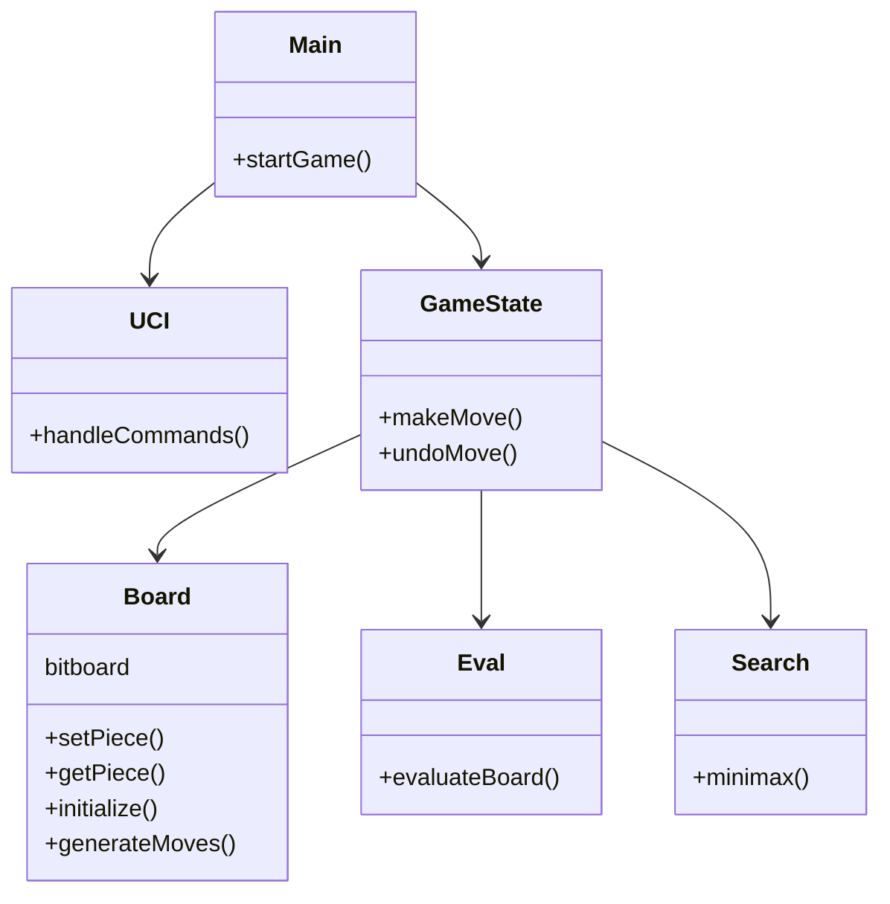

# Chesstutis

Chesstutis will be a UCI C++ chess engine eventually

# Resources

[simple minimax for chess](https://www.freecodecamp.org/news/simple-chess-ai-step-by-step-1d55a9266977/)

[C++ chess engine](https://ameye.dev/notes/chess-engine/)

[Chess Programming Wiki](https://www.chessprogramming.org/Main_Page)

[The Fascinating Programming of a Chess Engine - Bartek Spitza](https://youtu.be/w4FFX_otR-4?si=H6WCkaijLwwXqMZ7)

[Algorithms Explained – minimax and alpha-beta pruning - Sebastian Lague](https://youtu.be/l-hh51ncgDI?si=zrX8d2f7Ov7V-2IE)

[Coding adventure: Chess - Sebastian Lague](https://youtu.be/U4ogK0MIzqk?si=vrmSiL612RTlVxej)

[Coding Adventure: Making a Better Chess bot - Sebastian Lague](https://youtu.be/_vqlIPDR2TU?si=hVpPM-5AWTl2Fn6t)
